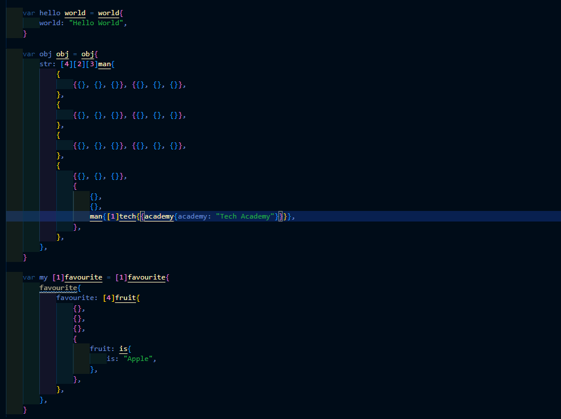
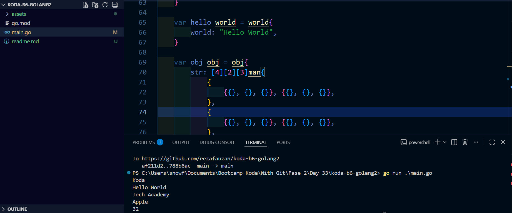

## Accessing Complex Struct and Array/Slice
	we.are.the.best
	hello.world
	obj.str[3][1][2].man[0].tech.academy
	my[0].favourite[3].fruit.is
	num.first[1] + num.second[2]

    accessing those structure with specific output bellow
    
    Koda
    Hello World
    Tech Academy
    Apple
    32

## Code Screenshoot

## Results Screenshoot

## Dependency
- fmt
this is a built in library from go lang to handle formating of input or output such as print to console, manipulating string etc

## How To Run It
- simply just download the circum-area.exe
- run it from windows with terminal
- or if you from linux download source code and build it with go build -o <name_build_result_executable>